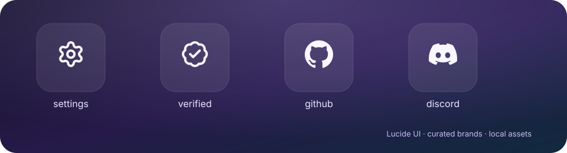

# Wolfsblvt Icons

[](docs/DEVELOPMENT.md#publication-boundary)
[](package.json)
[](docs/ARCHITECTURE.md#boundaries-and-integrations)

**One curated icon language for Wolfsblvt Works products.** `@wolfsblvt/icons` gives interface authors stable UI meanings, approved brand marks, namespaced original glyphs, and Astro components without turning every website into its own tiny SVG parliament.

Lucide supplies the ordinary UI language. Brands enter through an explicit catalogue with provenance and usage metadata. Product glyphs live in coherent families under durable names. Everything is installed and bundled locally: no runtime icon CDN, icon font, tracking request, or mystery asset bucket.

**[See the icons](#pop)** · [Try the source](#try-the-source) · [Use it with Astro](#astro-quick-start) · [Read the icon standard](docs/ICON-STANDARD.md)

## Pop



The starter catalogue is deliberately small. It proves the three important routes without copying whole upstream collections into a municipal archive:

| Lane | Public names | Source |
| --- | --- | --- |
| Semantic UI | `settings`, `verified`, `warning` | Curated aliases over Lucide |
| Direct UI | `lucide:badge-check` | Explicit Lucide escape route |
| Brands | `github`, `discord` | Curated Simple Icons entries |
| Product glyphs | `diffdevil/brand`, `wolfsblvt/works` | Reserved Works-authored namespaces; geometry intentionally pending |

The full generated [contact sheet](fixtures/contact-sheet.html) renders the catalogue at 16, 20, 24, and 32 pixels on light and dark surfaces, beside circle and square density references.

## Try the source

The repository is usable and qualified as source, but the npm package has **not** been published yet. The package remains `private: true` and versioned `0.0.0` until separate release work verifies control of the `@wolfsblvt` scope and the publication path.

```bash
git clone https://github.com/Wolfsblvt/wolfsblvt-icons.git
cd wolfsblvt-icons
npm install
npm test
npm run fixtures
```

A successful `npm test` formats-checks, builds, checks the Astro components, runs contract tests, validates metadata and authored SVGs, checks generated artifacts, and performs an npm pack dry run. Open `fixtures/contact-sheet.html` for the first visible result.

After the first authorised publication, consumer installation will be:

```bash
npm install @wolfsblvt/icons astro astro-icon
```

## Astro quick start

Configure `astro-icon` with the shared curated sets and any direct Lucide glyphs used by this consumer:

```js
// astro.config.mjs
import { defineConfig } from "astro/config";
import icon from "astro-icon";
import { createAstroIconOptions } from "@wolfsblvt/icons";

export default defineConfig({
  integrations: [
    icon(
      createAstroIconOptions({
        extraLucide: ["heart"],
      }),
    ),
  ],
});
```

Then use meaning rather than paths:

```astro
---
import {
  BrandIcon,
  ProductIcon,
  UiIcon,
} from "@wolfsblvt/icons/astro";
---

<UiIcon name="settings" />
<UiIcon name="lucide:heart" label="Favourite" />
<BrandIcon name="github" label="GitHub" />
<ProductIcon name="diffdevil/brand" />
```

The last line currently fails loudly because `diffdevil/brand` is reserved but has no approved geometry. That is intentional. A placeholder that quietly ships has a supernatural ability to become the permanent logo.~

## One system, three different obligations

### UI icons inherit one visual language

Repeated Works meanings receive semantic aliases such as `settings` and `verified`. A product may still use any suitable Lucide glyph through `lucide:<name>` without waiting for a central release merely to bless the existence of a heart.

### Brands are curated, not freely indexed

`BrandIcon` resolves only admitted catalogue entries. Each entry records its selected source, exact upstream revision, licence, trademark note, current guideline route, permitted colour modes, modifications, redistribution standing, and content hash when bytes are vendored.

GitHub and Discord are the first entries because the diffdevil website is the first intended consumer. Their geometry is read from the installed Simple Icons collection rather than copied into the runtime package.

### Original glyphs belong to families

Works-authored icons use stable `<product>/<icon>` names and live under `src/icons/products/`. Related concepts should be authored together when independent approximations would drift. The canonical [icon standard](docs/ICON-STANDARD.md) defines the 24×24 canvas, two-pixel stroke language, forbidden SVG machinery, visual comparison, provenance, and acceptance evidence.

The first custom canaries are:

- `diffdevil/brand`, a compact provider glyph for slots where the full favicon or wordmark is wrong; and
- `wolfsblvt/works`, a compact umbrella glyph for social and footer references where the formal lockup is wrong.

This repository establishes their API and authoring home. It does not fake their visual design.

## Accessibility

Components default to decorative SVG with `aria-hidden="true"`. Supply `label` only when a standalone icon carries information that surrounding content does not already provide. Icon-only controls need their accessible name on the control itself; their child icon normally remains decorative. State must never rely on icon shape or colour alone.

## Trust, rights, and local behavior

- **Local by construction.** Runtime SVG data comes from installed dependencies or generated package data. Nothing calls an icon CDN in the browser.
- **Inspectably curated.** Typed catalogues expose the allowed names; machine-readable metadata preserves source and rights context.
- **No logo laundering.** Official vendor marks retain their own rights and guidelines even when an upstream icon-data package is permissively licensed.
- **Original work stays simple.** Authored SVGs reject transforms, filters, masks, gradients, fixed colours, embedded text, raster data, and unexplained IDs.
- **Visual quality remains human work.** Automation catches structural violations; the contact sheet catches the distressed-paperclip problem.

## Documentation and development

- [Product vision](docs/VISION.md) explains the complete destination and protected boundaries.
- [Icon standard](docs/ICON-STANDARD.md) is the canonical source for selection, naming, authoring, brands, accessibility, and visual acceptance.
- [Architecture](docs/ARCHITECTURE.md) traces catalogue resolution through Astro and generated custom geometry.
- [Development](docs/DEVELOPMENT.md) owns bootstrap, commands, generated files, and common contribution paths.
- [Project map](docs/PROJECT-MAP.md) explains what lives where and why.
- [Decisions](docs/DECISIONS.md) preserves the consequential choices and rejected alternatives.
- [Third-party notices](THIRD_PARTY_NOTICES.md) records selected upstream material and fixture provenance.
- [Contributing](CONTRIBUTING.md) describes the public pull-request route and evidence expected from changes.

Wolfsblvt Icons is an open-source project from [Wolfsblvt Works](https://github.com/Wolfsblvt/Wolfsblvt), an independent software studio building local-first tools, open-source systems, AI integrations, and oddly useful software.

## License

Original work is licensed under the [MIT License](LICENSE.md); third-party icon data and marks retain the terms recorded in [Third-party notices](THIRD_PARTY_NOTICES.md) and per-asset metadata.
