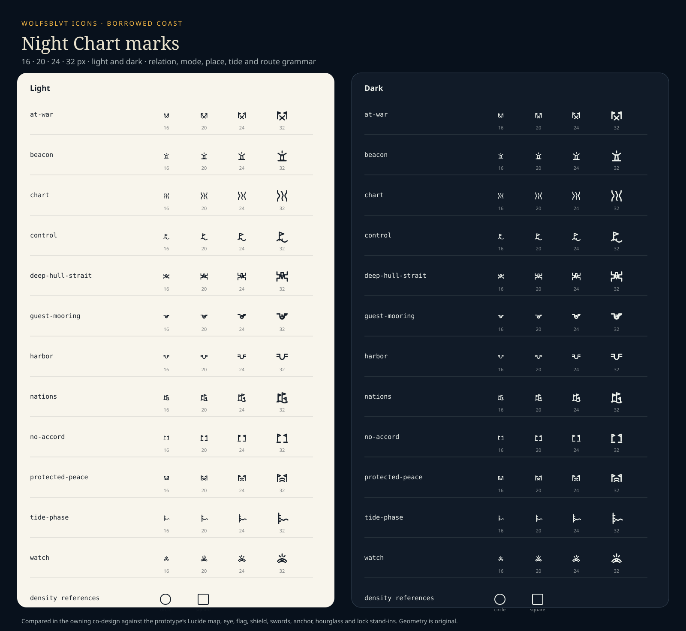

# Borrowed Coast icon family

## Meaning

This document maps Borrowed Coast's Night Chart interface to the shared icon system. It owns the stable names and semantic boundaries of the accepted Works-authored family, plus the ordinary Lucide concepts that deliberately remain ordinary.

The family exists because the game's own concepts are not generic nautical decoration. Standing, lawful observation, nation overlays, guest mooring, tide and navigability each carry game law that an eye, one flag, a shield, crossed swords, an anchor, a moon or a padlock would blur.



## Standing

Wolf accepted this twelve-glyph family on 6 October 2026 during the bounded co-design initiated from [the Borrowed Coast complete-interface room](https://github.com/Wolfsblvt/emergency-meeting/issues/678#issuecomment-6009445006).

His decisive changes were:

- keep custom `chart`, `watch`, and `nations` mode glyphs because the modes have their own product meaning and the current eye and single flag do not fit;
- retain one coherent relation triptych for `no-accord`, `protected-peace`, and `at-war`;
- retain the harbor and beacon chart language; and
- revise `chart` from hard angular coast strokes to three rounded, asymmetric coast contours.

The family is accepted geometry in this source candidate. Package publication and Borrowed Coast consumer adoption remain separate effects.

## Family grammar

These are **Night Chart marks**, not tiny maritime illustrations. They should feel drawn into the same chart on which coast, channels, intentions and watchlight live.

- Geography appears as basins, coast lines, water gaps and straits.
- Nation identity uses pennants only where the nation itself is the meaning.
- Relations keep the same two facing pennants and change the water or courses between them.
- Watch and tide marks describe situated evidence rather than omniscient or celestial abstractions.
- Every glyph inherits `currentColor`; state remains paired with visible wording and never relies on shape or colour alone.

## Accepted modes

### `borrowed-coast/chart`

**Meaning:** the default geography and navigation view.

Three rounded, asymmetric coast contours show that this mode is the inhabited coast itself. It is not a folded tourist map and must not be used as a generic map action.

### `borrowed-coast/watch`

**Meaning:** what the nation can lawfully observe now.

A watchlight throws layered arcs over water. It replaces the generic eye, which suggests universal sight and ignores the game's distinction between own lights, currently visible foreign things and uncertainty.

### `borrowed-coast/nations`

**Meaning:** control, territory, standings and nation overlays.

Several pennants inhabit one shared coast. One generic flag would imply a single selected country rather than a view of relationships and control across the coast.

## Accepted relation triptych

The two nation pennants remain fixed. The space between them carries the standing.

### `borrowed-coast/no-accord`

Open water separates the nations. Nothing is pending or broken: No Accord is a complete unprotected state in which coexistence creates no general peace guarantee.

### `borrowed-coast/protected-peace`

Two sheltered passage lines join the nations. Protection is the added fact, matching the game law that a protecting clause blocks surprise hostility until notice completes.

### `borrowed-coast/at-war`

Crossing hostile courses occupy the water between the nations. The mark describes conflict across the shared coast rather than reducing war to two generic swords.

The triptych must not be repurposed as sentiment, reputation, moral score or a generic success/warning/error scale.

## Accepted places, agreements and state

### `borrowed-coast/harbor`

An open basin with narrow approaches marks a harbor as geography. It is not an anchor, building or generic home icon.

### `borrowed-coast/guest-mooring`

A guest hull sits inside the host basin with its own tether. The guest remains a distinct protected ark and convoy rather than becoming host property or nation-pair immunity.

### `borrowed-coast/beacon`

A compact beacon tower throws restrained light marks. It identifies a chart beacon without expanding into decorative lighthouse art.

### `borrowed-coast/tide-phase`

A marked tide staff meets a live waterline. Tide is measured coastal water and tactical rhythm, not a moon phase.

### `borrowed-coast/control`

A nation pennant stands over the coast line. The mark carries supported control without relying on nation colour or becoming a detached generic flag.

### `borrowed-coast/deep-hull-strait`

Opposing coasts form the strait while a deep keel meets its threshold. The restriction is physical and vessel-specific, not an administrative lock.

## Ordinary UI stays ordinary

Borrowed Coast continues to use direct Lucide references for familiar interface actions and destinations, including:

- play, pause and replay transport;
- chevrons, panel toggles and close controls;
- generic history, scroll or letter presentation where no game-specific law is carried;
- ordinary deadline treatment where the visible lapse tide already carries the exact meaning; and
- generic settings, help, copy, download and external-link behavior.

Do not put a wave, barnacle or pennant on ordinary controls merely to make them look game-shaped. Product identity is not a tax levied on recognition.

## Accessibility and use

- Keep visible `Chart`, `Watch`, and `Nations` labels at ordinary density; their glyphs reinforce modes rather than teaching them alone.
- Pair standings with `No accord`, `Protected peace`, and `At war` text wherever the distinction matters.
- Icon-only controls keep their accessible name on the control; reusable SVGs remain decorative by default.
- The family uses `currentColor`. Amber, white, coral, nation colours, hatching and line treatment remain consumer-level state channels and never become fixed source paint.
- Use the exact names through `resolveProductIcon(...)` or `<ProductIcon name="borrowed-coast/..." />`; consumers do not copy SVG paths locally.

## Runtime and consumer consequence

The accepted family is authoritative in:

```text
src/icons/products/borrowed-coast/
src/metadata/products/borrowed-coast/
src/generated/custom-icons.ts
src/catalog/products.ts
```

Borrowed Coast may replace its temporary Lucide and inline prototype marks with these package names after this source candidate is accepted and a package version or other exact consumer route is available. This contribution does not publish the package or mutate the game repository.

A material change to one of these meanings or silhouettes needs another bounded visual contribution because the names become compatibility-bearing package API once admitted. Lived use may expose a misleading reading; that evidence should reopen the affected glyph, not spawn a second local copy with better manners and worse custody.
