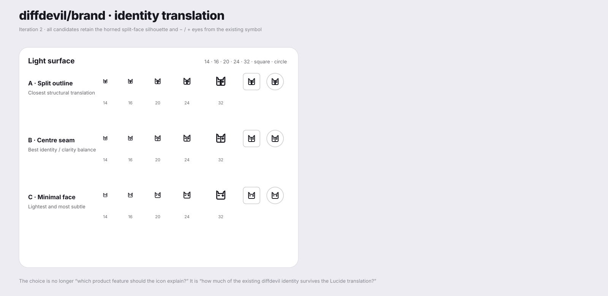

# `diffdevil/brand` candidate review

## Status

This directory is a bounded visual-authoring surface for the unresolved `diffdevil/brand` product glyph. It contains three original monochrome candidates and a self-contained three-panel comparison fixture.

None of these files is the accepted runtime asset. This tranche deliberately does **not** create `src/icons/products/diffdevil/brand.svg`, change the product metadata from `planned`, or expose any candidate through the package catalogue.

The immediate consumer is the compact `Changed` trigger selected for [diffdevil for GitHub](https://github.com/Wolfsblvt/emergency-meeting/issues/496). The eventual glyph must inherit `currentColor`, remain secondary to the visible `Changed` text, and survive a roughly 14–16 CSS pixel slot without turning into haunted stationery.

## Review surface

The review fixture is a three-panel contact sheet so each concern stays legible in GitHub's Markdown renderer:

1. [Candidate matrix](candidate-matrix.svg)
2. [Target `Changed` context](target-context.svg)
3. [Neighbour and identity references](comparison-references.svg)

Together the panels render every candidate at 16, 20, 24, and 32 pixels on light and dark surfaces, inside square and circular reference containers, in the target GitHub-style trigger, and beside relevant interface and brand references.

## Candidates

| Candidate | Strongest reading | Tradeoff |
| --- | --- | --- |
| **A · Diff scan** | Most immediately legible as diff inspection; strongest survival at 16 px. | The most functional and least overtly devilish; its scan-frame silhouette is intentionally familiar. |
| **B · Guarded change** | Communicates protected or policy-governed replacement through a shield and bidirectional change mark. | The densest candidate at 16 px and the one most likely to read as generic security tooling. |
| **C · Devil brackets** | Most distinctive product character: code brackets with restrained horn and tail cues, without becoming a face or mascot. | The small identity details compress first; at 16 px it can initially read as unusual braces. |

**Current recommendation: A · Diff scan.** The actual first consumer is a 14–16 px GitHub slot, and A preserves its intended meaning there with the least explanation. If stronger product character matters more than instant recognition, C is the better branch to iterate; decorating A until it impersonates C would produce the usual committee-designed soup.

## Candidate source contract

Each candidate source SVG follows the intended original-glyph contract:

- `viewBox="0 0 24 24"`;
- `fill="none"` and `stroke="currentColor"`;
- two-pixel stroke weight;
- round caps and joins;
- no width, height, fixed colour, transform, mask, filter, gradient, embedded text, or accessibility metadata; and
- simple path geometry with practical breathing room.

## Comparison provenance

The comparison sheet is review evidence, not a second icon catalogue.

- Lucide `file-diff`, `shield-check`, `scan-line`, and `code-xml` geometry was retrieved from `lucide-icons/lucide` commit `ba6751ac45d379f6359d75ef2228cff6ba96c122` on 2026-09-19. Exact source blob identities are recorded in the repository's third-party notice.
- GitHub and Discord reuse the repository's existing Simple Icons fixture geometry.
- The existing diffdevil mono and micro references reproduce the current symbol geometry from `Wolfsblvt/diffdevil` for comparison only. They remain full brand-symbol references, not candidates to trace, shrink, or expose as `diffdevil/brand`.

## Selection consequence

After Wolf selects a direction or asks for a focused iteration, the chosen geometry can be refined in this review lane. Acceptance is a separate explicit step: promote only the selected glyph into the product-icon source path, update its metadata and generated runtime data, regenerate the normal contact sheet, and run the full repository verification on that exact head.
