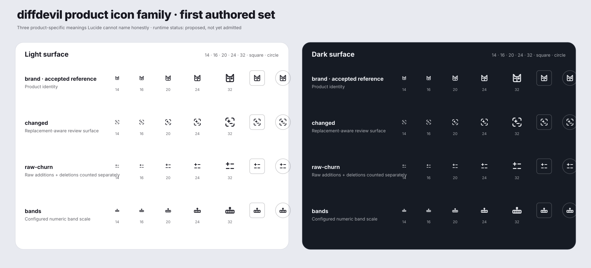
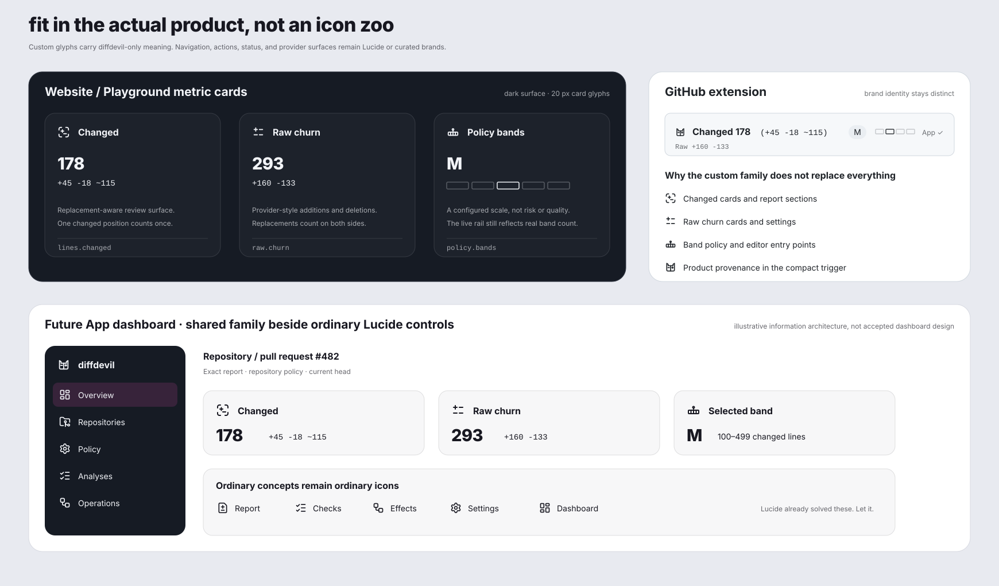

# diffdevil product icon family review

## Meaning

This directory carries the first authored diffdevil product-family tranche beyond the accepted brand glyph. It gives Wolf one concrete candidate for each product-specific meaning that ordinary Lucide icons cannot preserve honestly: replacement-aware `Changed`, raw churn, and configured policy bands.

The three candidates are **not alternatives**. They are proposed sibling glyphs with different jobs.

None is runtime source yet. This review deliberately does not create product metadata, generated icon data, package exports, or a false claim that the geometry was accepted merely because it exists on a branch.

## Review surfaces

1. [Candidate matrix](candidate-matrix.svg) shows the accepted brand reference and all three proposed glyphs at 14, 16, 20, 24, and 32 pixels on light and dark surfaces, plus square and circular containers.
2. [Product surface context](surface-context.svg) places the family inside website/Playground metric cards, the GitHub extension contract, and an illustrative dashboard composition beside ordinary Lucide controls.

## Proposed glyphs

### `diffdevil/changed`

A scan frame contains separate `+` and `−` facts.

**Strongest reading:** replacement-aware diff inspection and the product’s named `Changed` fact.

**Why this geometry:** Wolf already identified this silhouette during the brand-glyph round as a good icon for “Changed.” That was the correct meaning even though it was not sufficient product identity.

**Risk:** the scan-frame silhouette is familiar. Its distinctiveness comes from the internal change facts and the product context, not novelty for novelty’s sake.

### `diffdevil/raw-churn`

Two independent rows present `+` and `−` evidence separately.

**Strongest reading:** additions and deletions both count, with no pairing or cancellation.

**Why this geometry:** raw churn is specifically the sum of two provider-style sides. The glyph avoids arrows, exchange, or a tilde that could imply modified lines.

**Risk:** without visible `Raw churn` text, the mark can read as a compact add/remove list. It should accompany a label rather than become an unexplained standalone badge.

### `diffdevil/bands`

A segmented neutral rail carries one position marker.

**Strongest reading:** a configured ordinal scale and selected location.

**Why this geometry:** a chart implies observed trend and a gauge implies score or health. Bands are declared policy ranges. The neutral rail preserves that distinction.

**Risk:** the static glyph necessarily abstracts over the real number of configured bands. It must never replace the live dynamic rail.

## Recommendation

Admit all three as the first coherent diffdevil product family after any focused optical correction Wolf requests.

The family is intentionally compact:

- `brand` says **this belongs to diffdevil**;
- `changed` says **replacement-aware review surface**;
- `raw-churn` says **raw additions plus deletions**; and
- `bands` says **declared numeric policy scale**.

Everything else discovered in the audit has a stronger ordinary Lucide or curated-brand route. The complete source map lives in [`docs/product-families/diffdevil.md`](../../../docs/product-families/diffdevil.md).

## Candidate source contract

Each candidate follows the Works-authored source contract:

- `viewBox="0 0 24 24"`;
- `fill="none"`;
- `stroke="currentColor"`;
- two-pixel stroke;
- round caps and joins;
- simple path, rect, and circle geometry only; and
- no fixed color, transform, mask, clipping path, gradient, filter, text, accessibility metadata, or decorative micro-detail.

Repository tests validate these candidate files through the same SVG contract used by accepted runtime geometry.

## Comparison provenance

The review surfaces include the accepted `diffdevil/brand` source and a small set of Lucide neighbours solely to judge optical company:

- `file-diff`;
- `workflow`;
- `list-checks`;
- `layout-dashboard`;
- `folder-git-2`; and
- `settings`.

The Lucide geometry is comparison evidence, not a copied runtime catalogue. Exact source revision and blob identities are recorded in [`THIRD_PARTY_NOTICES.md`](../../../THIRD_PARTY_NOTICES.md).

## Selection consequence

Wolf’s next useful action is visual rather than architectural:

- accept the three-glyph family;
- request a focused correction to one named glyph; or
- reject one glyph because its product meaning is not clear enough.

After acceptance, the same PR can collapse to selected runtime geometry and remove the transient review panels, just as the brand-glyph contribution did. Git history can retain the design archaeology. The npm package does not need to become a museum.
